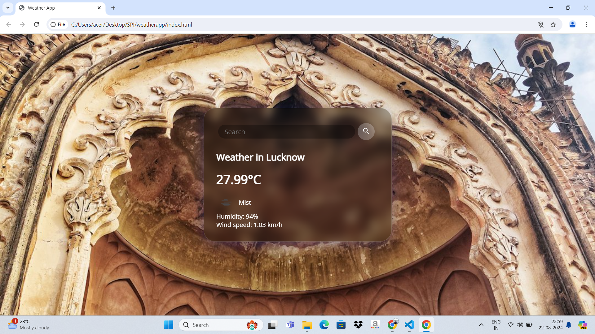
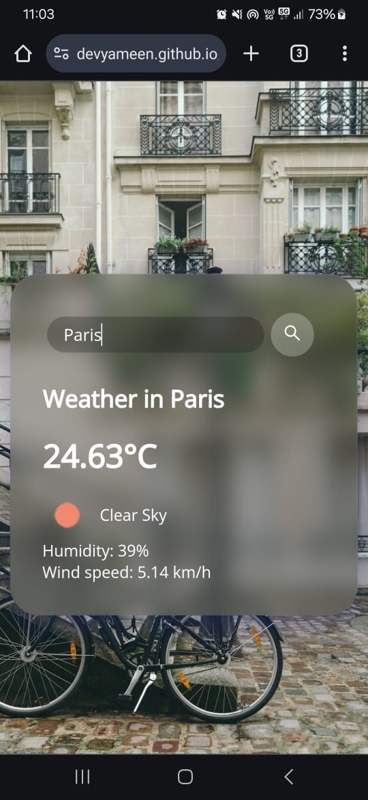

# Weather App

A weather application built using HTML, CSS, and JavaScript that provides real-time weather information and displays it in a user-friendly interface.

## Features

- **Real-Time Weather Data:** Fetches and displays current weather conditions for any city.
- **Dynamic Background:** Changes background image based on the searched city.
- **Responsive Design:** Ensures a seamless experience across various devices.
- **User-Friendly Interface:** Includes search functionality and visually appealing design.

## Technologies Used

- **HTML:** Structure and layout of the web application.
- **CSS:** Styling and layout for the weather app. Includes custom and responsive styles.
- **JavaScript:** Fetches weather data from the API and handles user interactions.
- **External APIs:**
  - [OpenWeatherMap API](https://openweathermap.org/api) for weather data.
  - [Unsplash API](https://unsplash.com/developers) for background images.

Screenshots
Here are some screenshots of the Weather_App in action:

Desktop View:

Mobile View:

## Installation

1. Clone the Repository:
   git clone https://github.com/DevYameen/Weather_App.git

2.Navigate to the Project Directory:
   cd Weather_App

3.Open the Project:
Open the `index.html` file in your web browser to view the application.

*Usage-
Search for a City:
Enter the name of a city in the search bar and press Enter or click the search button.

View Weather Information:
The current weather conditions for the searched city will be displayed, including temperature, weather description, and background image.

*Contributing
Contributions are welcome! To contribute:

*Fork the Repository

Create a New Branch:

git checkout -b feature/your-feature-name
Make Changes and Commit:

git add .
git commit -m "Add a descriptive commit message"
Push to the Branch:

git push origin feature/your-feature-name
Create a Pull Request

*License
This project is licensed under the MIT License - see the LICENSE file for details.

*Acknowledgements-
Unsplash for providing high-quality background images.
OpenWeatherMap for offering a comprehensive weather data API.
Feel free to reach out if you have any questions or suggestions!
